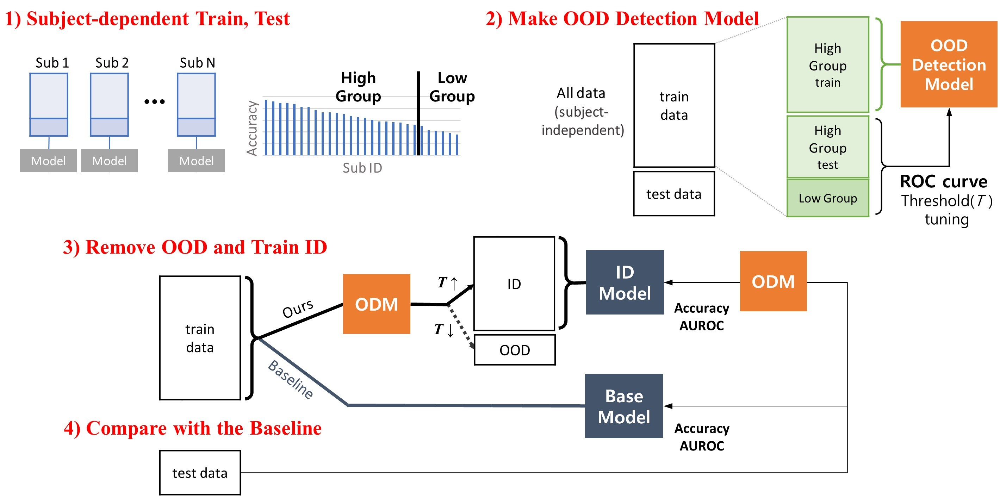
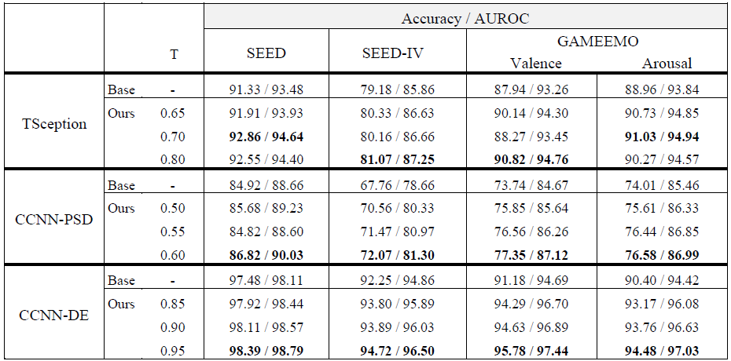

# Granularity
OOD for EEG signals

## Dataset 
- **SEED** : 3 class *(netral, positive, negative)*
- **SEED-IV** : 4 class *(happiness, sadness, fear, neutral)*
- **GAMEEMO** : 9 class  *(valence, arousal)*
- **DEAP** :  9 class  *(valence, arousal)*
---

### **Preprocessing** (Offline Transform, Feature Extraction ...)
**0.0 preprocessing.py** 
*Temporal Segmentation (Sliding Window, Time Partitioning, Time Window, ...)* 
\+ *Feature Extraction (Signal Transformation, Dimensionality Reduction, ...)*
- Segmentation (Raw Signal)
- Segmentation + DE (Differential Entropy)
- Segmentation + PSD (Power Spectral Density)
    | | Seg `(channels, window)` | Seg + DE `(channels, 4 bands)` | Seg + PSD `(channels, 4 bands)` |
    | --- | :---:| :---: | :---: |
    | **SEED**    | `(62, 400)` | `(62, 4)` | `(62, 4)` |
    | **SEED-IV** | `(62, 400)` | `(62, 4)` | `(62, 4)` |
    | **GAMEEMO** | `(14, 256)` | `(14, 4)` | `(14, 4)` |
    | **DEAP**    | `()` | `()` | `()` |

`EEG channels(num_electrodes), Segment size(Window size)`

### **Make Dataset** 
train and test data are split for reliable generalization evaluation. 
**0.1 make dataset.py** : *( train : test = 9 : 1 )*

---

## Our Method

### **1) Subject-dependent Train, Test**  
**0.2 subdepend.py**: For each subject, **subdepend.py** is executed.

### **2) Make OOD Detection Model**  
**1.0 OOD detector.py** 
- Data Pipeline
  - scaling
    - Raw Signal - standardization
    - PSD - log transformation
  - deshape(reshape)
    - CCNN - grid: make 9x9 grid (samples, channels, 4 bands) -> (samples, 4 bands, 9, 9)
    - TSC/EEGNet - expand : (samples, channels, window) -> (samples, 1, channels, window)
  
- Model 
  - CCNN : https://link.springer.com/chapter/10.1007/978-3-030-04239-4_39
  - TSCeption : https://arxiv.org/abs/2104.02935
  - EEGNet : https://arxiv.org/abs/1611.08024
  - DGCNN : https://ieeexplore.ieee.org/abstract/document/8320798
- Hyperparameter
    |         | CCNN   | TSCeption| EEGNet | DGCNN  |
    | ---     | :----: | :-------:| :----: | :----: |
    | epoch   | 100    |    200   |  200   |   100  |
    | max_lr  | 1e-4   |   1e-3   |  1e-3  |  1e-3  |
    | dropout | 0.5    |   0.5    |   0.5  |    -   |
    |  |  |  |  |  |
    |  |  |  |  |  |

- criterion = `torch.nn.CrossEntropyLoss()`
- optimizer = `torch.optim.Adam(model.parameters(), lr=0, weight_decay=1e-4)`
- scheduler = `CosineAnnealingWarmUpRestarts(optimizer, eta_max=max_lr)`  utils > scheduler.py

### **3) Remove OOD and Train ID**  
**2.0 Base_Remove.py** 
Setting the threshold of ODM to adjust the OOD removal rate (approximately 10%).

|     | CCNN/DGCNN-PSD | CCNN/DGCNN-DE | TSCeption | EEGNet |
| --- | :---:| :---: | :---: | :---: |
| threshold | 0.50~ | 0.85~ | 0.65~ | -  |

### **4) Compare with the Baseline**
In **2.0 Base_Remove.py**, `trheshold==0` is equivalent to Baseline.

## Results

